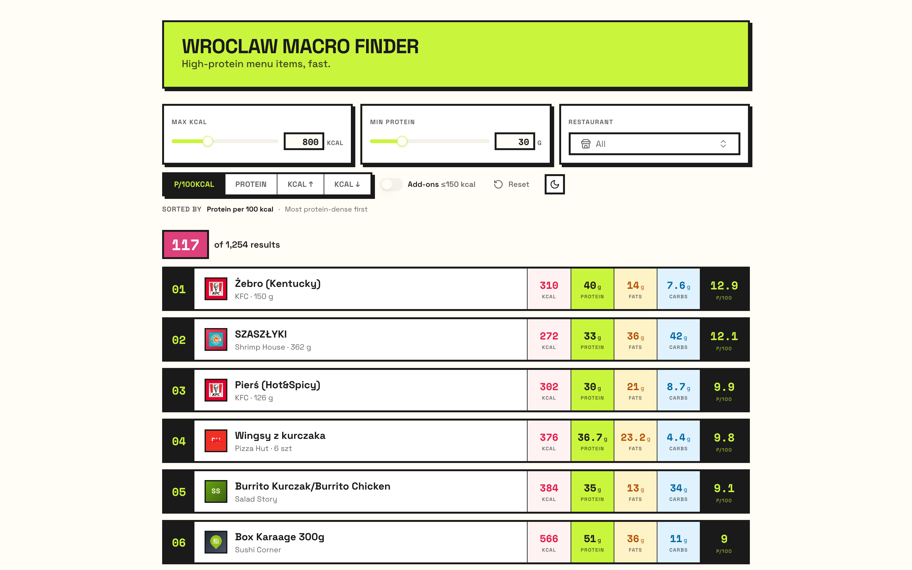
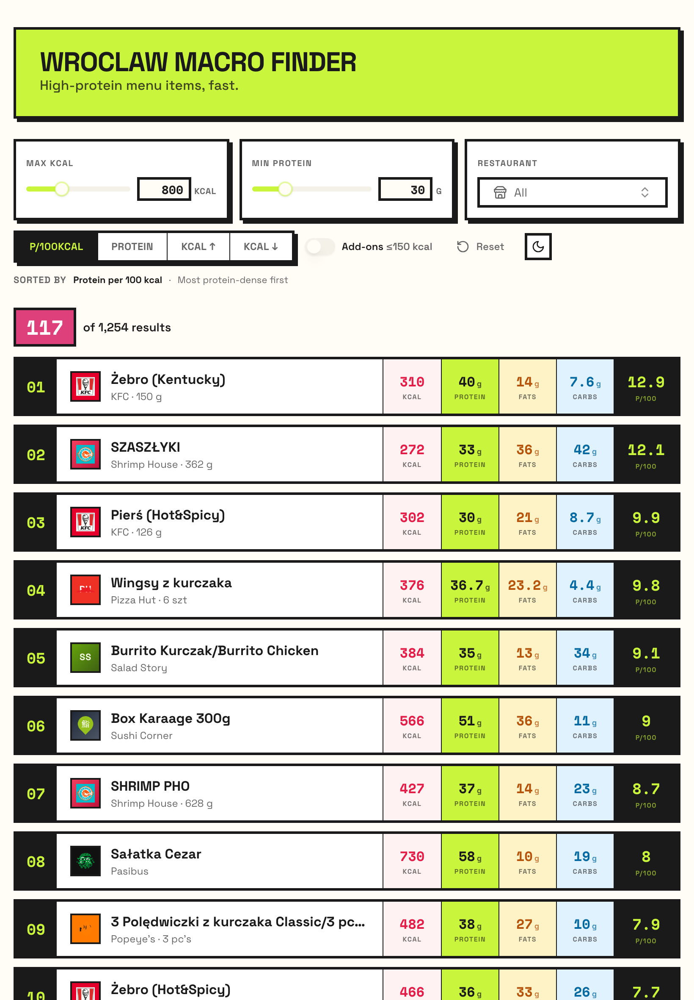
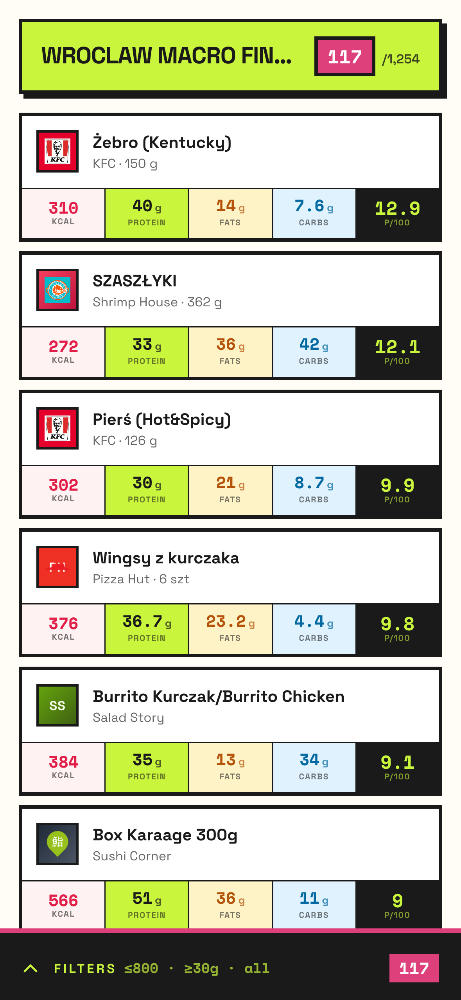
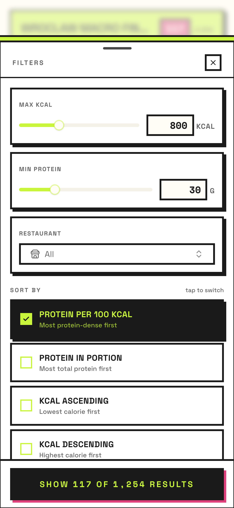

# Wrocław Macro Finder

Find high-protein, low-kcal items at restaurants around Wrocław. Filter by max kcal, min protein, restaurant, and sort by protein density or total protein per portion.

**Live demo:** https://wroclaw-macro-finder.vercel.app

## Screenshots

| Desktop | Tablet |
|---|---|
|  |  |

| Mobile · default | Mobile · filter sheet |
|---|---|
|  |  |

On mobile, the filter controls collapse into a chunky bottom pill (`FILTERS · ≤800 · ≥30g · all`) that opens a full-screen sheet — every control stays under thumb, and the sort options spell out exactly what they do (protein per 100 kcal, protein in portion, kcal ascending, kcal descending).

## Overview

Two parts in this repo:

- **Static SPA (`frontend/`)** — Vite + React + TypeScript. The deployed app is purely static: it loads a single bundled JSON file at runtime and filters in-browser.
- **Python toolkit (`src/`, `scripts/`)** — interactive CLI, FastAPI dev server, deterministic macro extractors (HTML scrapers + PDF parsing), and the SQLite database the frontend's JSON is exported from.

You only need Python locally if you are refreshing data or running the API/CLI. The deployed site needs nothing beyond static hosting.

## Data

Macros come from each restaurant's public sources via a deterministic pipeline (HTML scrapers + PDF parsing). Refreshes are manual today; automated cadence is on the roadmap.

## Data flow

```
sources.csv ──▶ extractors ──▶ macros.csv ──▶ ingest ──▶ SQLite
                                                            │
                                            export_static_json.py
                                                            ▼
                                          frontend/public/data/foods.json
                                                            │
                                                       npm run build
                                                            ▼
                                                Vercel static deploy
```

## Data layout

| Path | Role |
|------|------|
| `data/sources.csv` | Restaurants, links to macro sources, formats, notes |
| `data/macros.csv` | Per-item nutrition (produced before or alongside DB ingest) |
| `data/main_database.db` | SQLite database (paths resolved relative to project root in `app/db.py`) |
| `frontend/public/data/foods.json` | Static export consumed by the deployed SPA |

## Run the frontend

The deployed app is fully static — no backend required.

Requirements: **Node.js 20+**, **npm**.

```bash
cd frontend
npm install
npm run dev          # http://localhost:5173
```

The dev server serves `frontend/public/data/foods.json` directly. To regenerate that file from SQLite, see [Refresh the data](#refresh-the-data).

Production build:

```bash
npm run build        # static files in frontend/dist/
npm run preview
```

## Run the Python toolkit

For the interactive CLI, the FastAPI dev server, and the macro extractors.

Requirements: **Python 3.11+**.

```bash
python -m venv .venv
source .venv/bin/activate    # Windows: .venv\Scripts\activate
pip install -e .
```

Optional `.env` (only needed for OpenAI-backed PDF extraction):

```env
OPENAI_SECRET_KEY=sk-...
```

### Interactive CLI

```bash
cd src
python main.py
```

Re-import both CSVs into the database (sources first, then foods):

```bash
cd src
python main.py --reingest-database
```

The CLI prompts for max kcal, min protein, optional restaurant id, low-kcal add-on inclusion, result limit, and sort mode.

### HTTP API (development only)

Useful for poking at the data with curl or via http://127.0.0.1:8000/docs.

```bash
cd src
uvicorn app.api:app --reload --host 127.0.0.1 --port 8000
```

Example:

```http
GET /foods/search?max_kcal=800&min_protein=40&limit=10&sort_by=protein_ratio_desc
```

The API also exposes `GET /restaurants`. **Note:** the deployed frontend does not use this API — it reads `foods.json` directly. The API exists for local tooling and exploratory work.

### Refresh the data

After re-extracting or re-ingesting, re-export the static JSON the SPA consumes:

```bash
python scripts/export_static_json.py
```

Then commit the updated `frontend/public/data/foods.json` (and `data/main_database.db` per the [MVP Data Policy](#mvp-data-policy)).

## Extract macros

Reads `data/sources.csv` and updates `data/macros.csv`. By default uses HTTP + HTML parsing (no billable API) for chains like HulThai, MAX Burgers, LUCA, Pan Precel, Shrimp House, Pizzatopia, and merges into the existing CSV so other restaurants are left untouched.

```bash
cd src
python -m app.extract_macros --only "HulThai" "MAX Burgers"
```

- `--no-merge`: write only rows produced in this run (overwrites unrelated restaurants' rows in the output file).
- `--use-openai` or `MACRO_USE_OPENAI=1`: run the OpenAI Responses flow for supported PDFs (requires `OPENAI_SECRET_KEY`). Without this, PDF rows are skipped unless you extend `app.macro_extract.pdf_local`.

Legacy PDF-only OpenAI run (full rewrite, no merge):

```bash
cd src
python -m app.api_pdfs
```

## Deployment

Deployed to Vercel as static files (`vercel.json`):

- Build command: `cd frontend && npm ci && npm run build`
- Output: `frontend/dist/`

No Python runs in production.

## Development

Optional quality checks (install tools in your venv if missing):

```bash
ruff check .
ruff format --check .
mypy src/
pytest
```

## MVP Data Policy

`data/main_database.db` is **intentionally tracked in Git** so the static export can be regenerated from any clone without rebuilding the data pipeline. This is an MVP-stage decision — once the data layer is hosted elsewhere, the file will be re-ignored in `.gitignore`.

If you update the DB, make sure changes are intentional and don't include sensitive information.

## How this was built

I first built the Python core myself: the data model, ingest pipeline, search/sort logic, FastAPI service, CLI flow, and initial search tests. That baseline is preserved at git tag [`mvp-self-snapshot-v1`](https://github.com/ShowzZzie/wroclaw-macro-finder/tree/mvp-self-snapshot-v1).

After the core was working, I used AI coding tools (Claude Code and Cursor) to accelerate frontend implementation, source-specific extraction adapters under `src/app/macro_extract/`, UI polish, deployment wiring, and follow-up refinements. I reviewed, tested, and integrated the generated changes.

## License / status

Early-stage personal project; behaviour and data coverage may change.
